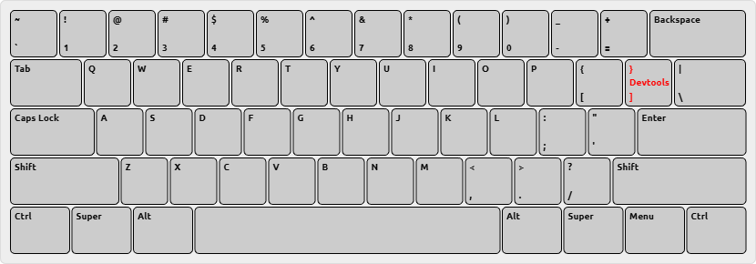

# Bitmapper
Пиксельный редактор(пока что рисовалка)


### Управление
Рисовать на холсте ЛКМ или просто одним пальцем

Перемещать холст ПКМ

Масштабировать холст колесиком мыши

Горячие клавиши(пока одна):


### Плагины
Все плагины представляют собой .js файлы с классом, унаследованным от Plugin https://github.com/mrybs/bitmapper/blob/master/plugins/plugin.js
```js
Plugin.meta = {
    id: 'plugin-id',
    name: 'Название плагина',
    version: '1.0.0',
    require: []
}
```

Также в плагине должен присутствовать метод load, отвечающий за загрузку плагина
