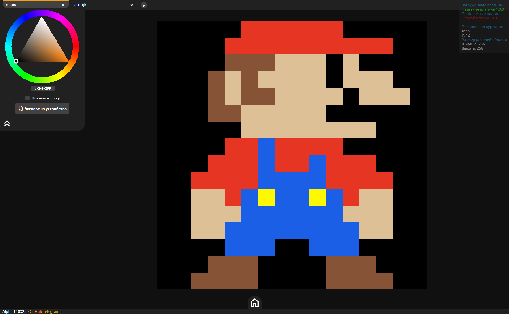
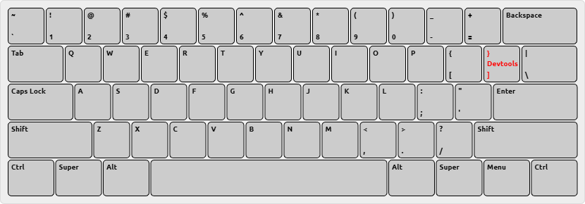

# Bitmapper
Пиксельный редактор(пока что рисовалка :bowtie:)




## Использование
### Управление
- Рисовать на холсте ЛКМ или просто одним пальцем.
- Перемещать холст ПКМ, с тач-экранов никак.
- Масштабировать холст колесиком мыши, с тач-экранов никак.

Горячие клавиши(пока одна):



## Модификация
### Плагины
Все плагины представляют собой .js файлы с классом, унаследованным от Plugin https://github.com/mrybs/bitmapper/blob/master/plugins/plugin.js .

В каждом классе плагина должно присутствовать поле meta:
```js
Plugin.meta = {
    id: 'plugin-id',
    name: 'Название плагина',
    version: '1.0.0',
    require: []
}
```

Также в плагине должен присутствовать метод load, отвечающий за загрузку плагина.

Собственно вот хелоуворлд плагин:

```js
class MyFirstPlugin extends Plugin{
    constructor(){
        this.meta = {
            id: 'my-first-plugin',
            name: 'Мой первый плагин',
            version: '0.0.1',
            require: []
        }
    }
    load(){
        setTimeout(() => {
            alert('Hello, world!')
        }, 0)
    }
}
```

> [!IMPORTANT]
> Здесь alert `Hello, world!` выполняется через setTimeout с задержкой 0 дабы не занимать основой поток. В будущих сборках битмаппера будут ограничения по времени загрузки плагина, поэтому работа плагина может быть нарушена.

### Кисти
Все кисти представляют собой классы, унаследованные от Brush https://github.com/mrybs/bitmapper/blob/master/brush.js .

В каждой кисти должно присутствовать поле meta:

```js
Brush.meta = {
    id: 'brush',
    name: 'Кисть'
}
```

В конструктор кисти принимается canvas рабочей области и size размер кисти. От канваса по сути нужен только его метод canvas.setPixel(pos, color), который устанавливает заданный цвет color на координату pos рабочей области.

Рисованием занимается метод кисти draw. Он принимает в качестве аргументов pos позицию рабочей области на которой была использована кисть и color цвет кисти. 

Собственно вот пример кисти, которая рисует квадраты заданных размеров size в конструкторе:

```js
class SquaredBrush extends Brush{
    constructor(canvas, size){
        super(canvas, size)
        this.meta = {
            'name': 'Квадратная кисть'
        }
    }
    draw(pos, style){
        for(let yi = 0; yi < this.size; yi++){
            for(let xi = 0; xi < this.size; xi++){
                this.canvas.setPixel(new Vector(Math.round(pos.x-this.size/2+xi), Math.round(pos.y-this.size/2+yi)), style)
            }
        }
    }
}
```

> [!NOTE]
> Кисть должна устанавливаться с помощью плагина, но на этом развитие остановилось, ждём новых сборок битмаппера.